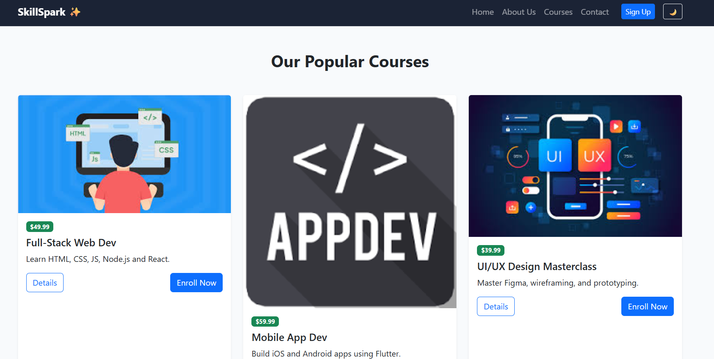
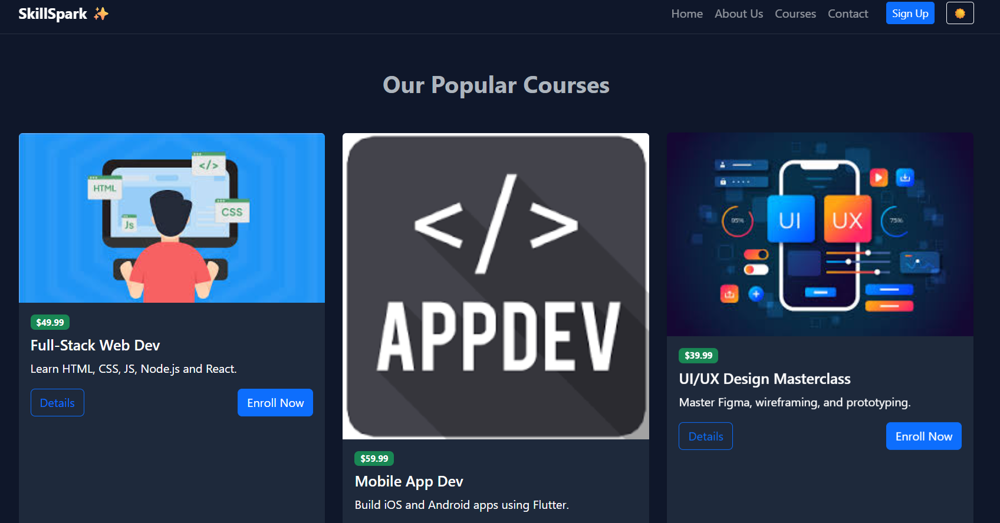
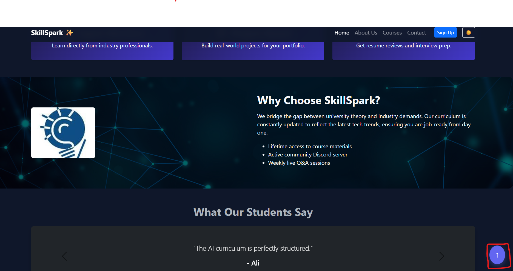
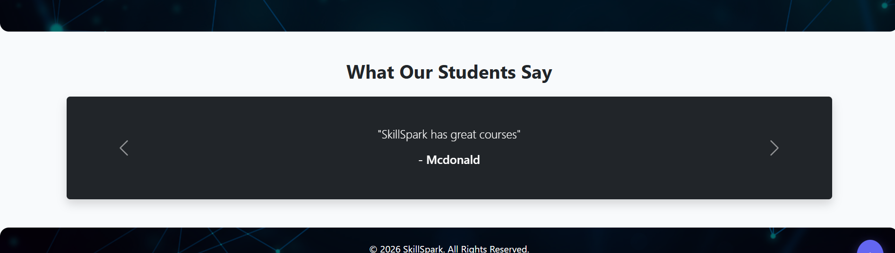
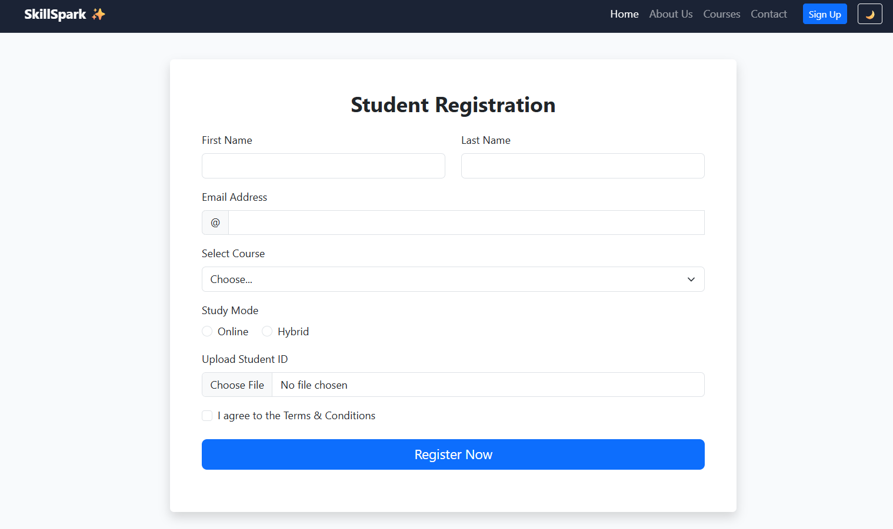
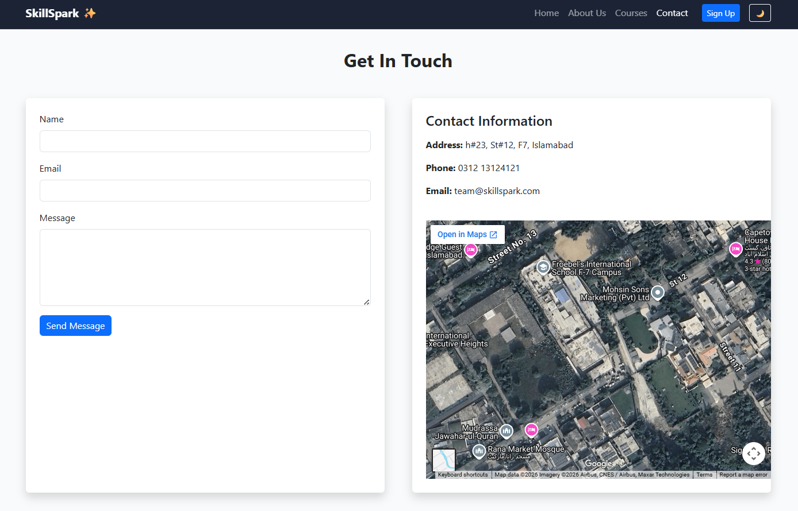
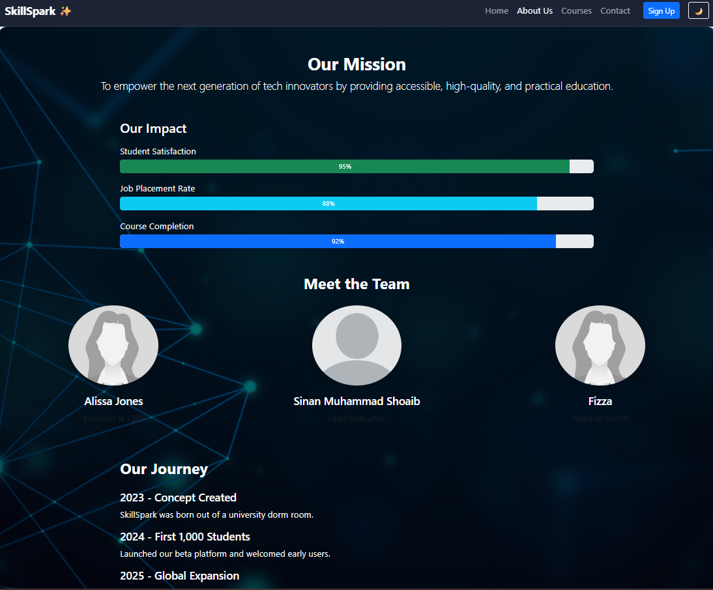
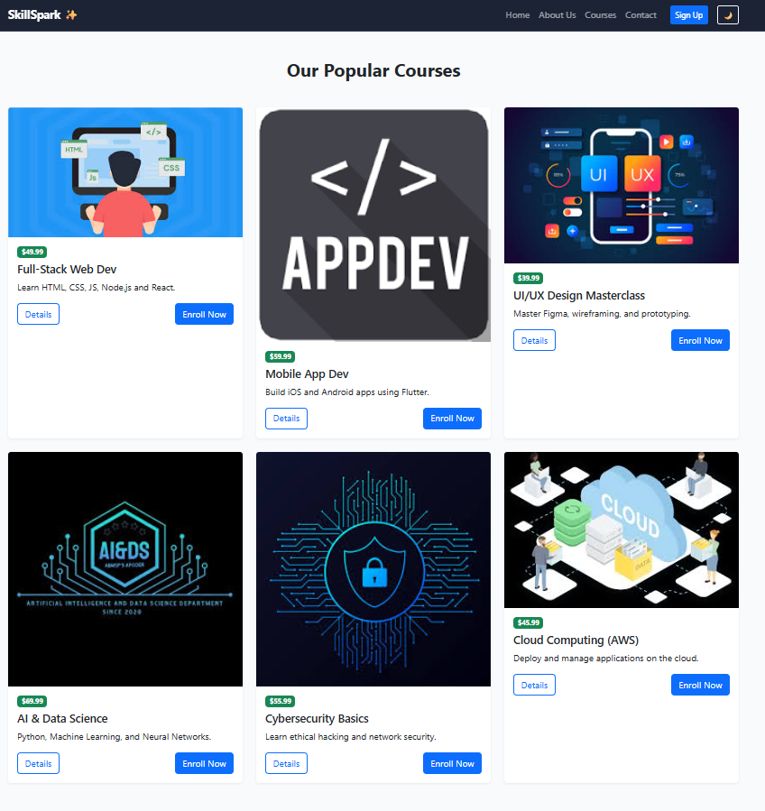
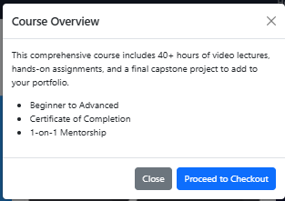

This site can viewed live at: https://sinanmshoaib.github.io/Assignment-1/
Project Description
SkillSpark is a webpage dedicated to students, where they can sign up and learn important skills from certified industry experts. the website provides a streamlined experianced so that students can sign up and get started on learning without any time wasted. 

<!-- b) Features -->
Dual Theme Support: A custom-coded Dark Mode toggle that persists across all pages using JavaScript.
Light Mode:

Dark Mode:

Interactive UI: A "Back to Top" button for better user navigation.

Dynamic Carousel: A Bootstrap-powered testimonial slider.

Hover Animations: Elevated card effects for a premium feel.

Form: for students can login to the website.

Contact Page: students can directly contact the Skillspark team regarding any queries they might have.

About Us page: where students can veiw our journey from the beginning.

Courses Page: Where students ca nveiw all the courses we offer.

Each course has an in-depth details pop-up.

